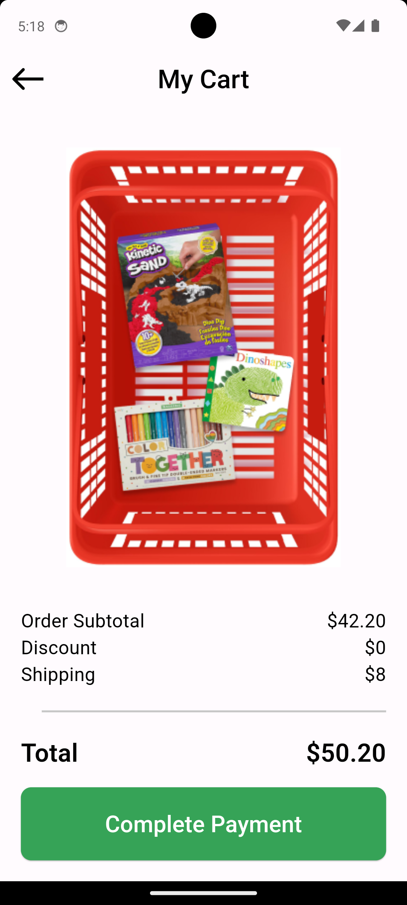
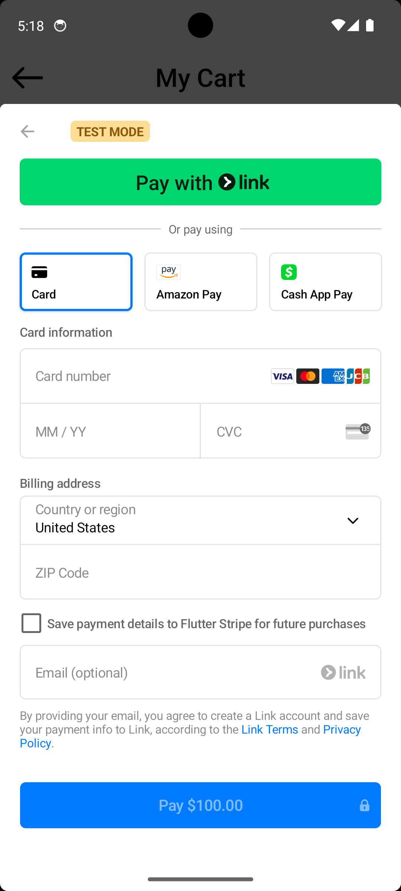
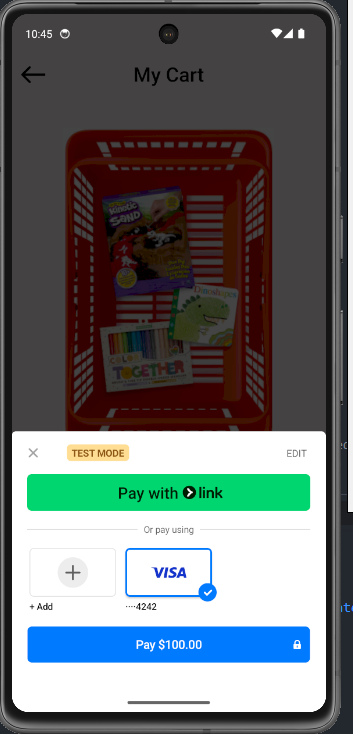

# Checkout - Payment Gateway Implementation Using Stripe

This Flutter project implements a payment gateway using Stripe, allowing users to make payments and save their card details for future transactions. The application provides a seamless and secure payment experience with various features to enhance user convenience.

## Features

- **Test Mode**: Supports a test mode for development and testing purposes.
- **Multiple Payment Options**: Users can pay using:
  - **Link**: A quick and secure payment method.
  - **VISA**: Direct payment using VISA cards.
  - **Amazon Pay**: Integration with Amazon Pay for convenience.
- **Card Information Management**: Users can save their card details (VISA) for future payments, including:
  - Card number
  - Expiration date (MM/YY)
  - CVC
- **Billing Address**: Users can provide their billing address, including country/region and ZIP code.
- **Email Integration**: Optional email collection for creating a Link account and saving payment information.
- **Discounts and Subtotal**: Calculates the order subtotal and applies any discounts before completing the payment.

## Screenshots

### Cart Summary

### Payment Interface

### saved Payment cards

## Getting Started

This project is a starting point for a Flutter application.

A few resources to get you started if this is your first Flutter project:

- [Lab: Write your first Flutter app](https://docs.flutter.dev/get-started/codelab)
- [Cookbook: Useful Flutter samples](https://docs.flutter.dev/cookbook)

For help getting started with Flutter development, view the
[online documentation](https://docs.flutter.dev/), which offers tutorials,
samples, guidance on mobile development, and a full API reference.

## Usage

1. **Add Items to Cart**: Users can add items to their cart, and the application will calculate the subtotal.
2. **Apply Discounts**: Any applicable discounts will be applied to the order.
3. **Select Payment Method**: Users can choose their preferred payment method (Link, VISA, Amazon Pay).
4. **Enter Card Details**: For card payments, users need to enter their card details.
5. **Save Card for Future Use**: Users have the option to save their card details for future payments.
6. **Complete Payment**: Once all details are entered, users can complete the payment.

## Configuration

To set up the application, you need to configure the Stripe API keys and other necessary settings in the configuration files. Ensure that the test mode is enabled during development.

## Dependencies

- Stripe API
- Flutter Stripe for payment processing

## Contributing

Contributions are welcome! Please fork the repository and submit a pull request with your changes.

## License

This project is licensed under the MIT License. See the LICENSE file for details.

## Acknowledgments

- Stripe for providing the payment gateway API.
- Flutter community for the support and resources.

---

This README provides an overview of the application's features and usage. For more detailed instructions, refer to the documentation in the repository.
